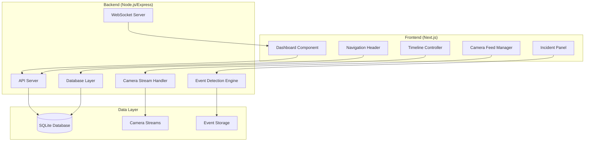

# Design Document

## Overview

The MANDLAC-X security monitoring dashboard is a real-time surveillance system built with a Next.js frontend and Node.js backend. The system provides live camera feed monitoring, incident detection and tracking, timeline-based event review, and comprehensive security management capabilities. The design follows a classic security control room interface with dark theme, high contrast elements, and intuitive navigation optimized for 24/7 monitoring operations.

## Architecture

### System Architecture



### Technology Stack

- **Frontend**: Next.js 15.4.2, React 19, TypeScript, Tailwind CSS
- **Backend**: Node.js, Express.js, SQLite3
- **Real-time Communication**: WebSocket for live updates
- **Styling**: Tailwind CSS with custom dark theme
- **Icons**: Lucide React for consistent iconography
- **State Management**: React hooks and context for local state

## Components and Interfaces

### Frontend Components

#### 1. Dashboard Layout Component
- **Purpose**: Main container for the entire dashboard interface
- **Props**: `user`, `activeTab`, `onTabChange`
- **Features**:
  - Dark theme with orange accent colors (#FFA500)
  - Responsive grid layout
  - Header with navigation and user profile
  - Main content area with camera feeds and incident panel

#### 2. Navigation Header Component
- **Purpose**: Top navigation bar with tabs and user information
- **Props**: `activeTab`, `onTabChange`, `user`, `incidentCount`
- **Features**:
  - MANDLAC-X branding with logo
  - Navigation tabs: Dashboard, Cameras, Scenes, Incidents, Users
  - User profile dropdown with avatar
  - Real-time incident counter badge

#### 3. Camera Feed Manager Component
- **Purpose**: Manages multiple camera feeds and switching
- **Props**: `cameras`, `activeCamera`, `onCameraSwitch`
- **Features**:
  - Main camera feed display (large central view)
  - Thumbnail camera grid (2x2 layout)
  - Camera status indicators
  - Feed switching functionality
  - Error state handling for offline cameras

#### 4. Incident Panel Component
- **Purpose**: Displays real-time security incidents and alerts
- **Props**: `incidents`, `onResolveIncident`
- **Features**:
  - Scrollable incident list
  - Color-coded severity indicators (red for high, orange for medium)
  - Incident type icons and descriptions
  - Timestamp and location information
  - Resolve action buttons
  - Unresolved incident counter

#### 5. Timeline Controller Component
- **Purpose**: Video playback timeline with event markers
- **Props**: `currentTime`, `duration`, `events`, `onTimeChange`
- **Features**:
  - Horizontal timeline scrubber
  - Event markers with color coding
  - Playback controls (play, pause, forward, backward)
  - Time display and navigation
  - Camera selection for timeline view

#### 6. Camera List Component
- **Purpose**: Bottom panel showing all cameras with event indicators
- **Props**: `cameras`, `events`, `onCameraSelect`
- **Features**:
  - Horizontal camera list
  - Event indicator bars with color coding
  - Camera status and labels
  - Quick camera switching

### Backend API Interfaces

#### 1. Camera Management API
```typescript
interface Camera {
  id: string;
  name: string;
  location: string;
  status: 'online' | 'offline' | 'error';
  streamUrl: string;
  lastSeen: Date;
}

// Endpoints
GET /api/cameras - Get all cameras
GET /api/cameras/:id - Get specific camera
PUT /api/cameras/:id/status - Update camera status
```

#### 2. Incident Management API
```typescript
interface Incident {
  id: string;
  type: 'unauthorized_access' | 'gun_threat' | 'traffic_congestion' | 'face_recognized';
  severity: 'high' | 'medium' | 'low';
  cameraId: string;
  timestamp: Date;
  status: 'active' | 'resolved';
  description: string;
  imageUrl?: string;
}

// Endpoints
GET /api/incidents - Get all incidents
POST /api/incidents - Create new incident
PUT /api/incidents/:id/resolve - Resolve incident
GET /api/incidents/unresolved - Get unresolved count
```

#### 3. Event Timeline API
```typescript
interface Event {
  id: string;
  cameraId: string;
  type: string;
  timestamp: Date;
  duration: number;
  metadata: Record<string, any>;
}

// Endpoints
GET /api/events/timeline - Get events for timeline
GET /api/events/camera/:id - Get events for specific camera
```

#### 4. User Management API
```typescript
interface User {
  id: string;
  username: string;
  email: string;
  role: 'admin' | 'operator' | 'viewer';
  avatar?: string;
  lastLogin: Date;
}

// Endpoints
POST /api/auth/login - User authentication
GET /api/users/profile - Get current user profile
PUT /api/users/profile - Update user profile
```

## Data Models

### Database Schema

#### Cameras Table
```sql
CREATE TABLE cameras (
  id TEXT PRIMARY KEY,
  name TEXT NOT NULL,
  location TEXT NOT NULL,
  stream_url TEXT NOT NULL,
  status TEXT DEFAULT 'offline',
  last_seen DATETIME,
  created_at DATETIME DEFAULT CURRENT_TIMESTAMP
);
```

#### Incidents Table
```sql
CREATE TABLE incidents (
  id TEXT PRIMARY KEY,
  type TEXT NOT NULL,
  severity TEXT NOT NULL,
  camera_id TEXT NOT NULL,
  timestamp DATETIME NOT NULL,
  status TEXT DEFAULT 'active',
  description TEXT,
  image_url TEXT,
  resolved_at DATETIME,
  created_at DATETIME DEFAULT CURRENT_TIMESTAMP,
  FOREIGN KEY (camera_id) REFERENCES cameras(id)
);
```

#### Events Table
```sql
CREATE TABLE events (
  id TEXT PRIMARY KEY,
  camera_id TEXT NOT NULL,
  type TEXT NOT NULL,
  timestamp DATETIME NOT NULL,
  duration INTEGER DEFAULT 0,
  metadata TEXT, -- JSON string
  created_at DATETIME DEFAULT CURRENT_TIMESTAMP,
  FOREIGN KEY (camera_id) REFERENCES cameras(id)
);
```

#### Users Table
```sql
CREATE TABLE users (
  id TEXT PRIMARY KEY,
  username TEXT UNIQUE NOT NULL,
  email TEXT UNIQUE NOT NULL,
  password_hash TEXT NOT NULL,
  role TEXT DEFAULT 'viewer',
  avatar_url TEXT,
  last_login DATETIME,
  created_at DATETIME DEFAULT CURRENT_TIMESTAMP
);
```

## Error Handling

### Frontend Error Handling
- **Camera Feed Errors**: Display placeholder with error message and retry button
- **Network Errors**: Show connection status indicator and auto-retry mechanism
- **Authentication Errors**: Redirect to login page with appropriate error message
- **API Errors**: Toast notifications for user feedback
- **Real-time Connection Loss**: Visual indicator and automatic reconnection

### Backend Error Handling
- **Database Errors**: Proper error logging and graceful degradation
- **Camera Stream Errors**: Status tracking and error reporting
- **Authentication Errors**: Secure error responses without information leakage
- **Rate Limiting**: Implement request throttling for API endpoints
- **Validation Errors**: Comprehensive input validation with clear error messages

## Testing Strategy

### Frontend Testing
- **Unit Tests**: Component testing with React Testing Library
- **Integration Tests**: API integration and user flow testing
- **Visual Tests**: Screenshot testing for UI consistency
- **Accessibility Tests**: WCAG compliance testing
- **Performance Tests**: Bundle size and rendering performance

### Backend Testing
- **Unit Tests**: API endpoint testing with Jest
- **Integration Tests**: Database operations and external service integration
- **Load Tests**: Performance testing under high concurrent load
- **Security Tests**: Authentication and authorization testing
- **Database Tests**: Data integrity and migration testing

### End-to-End Testing
- **User Workflows**: Complete user journey testing
- **Real-time Features**: WebSocket connection and event handling
- **Cross-browser Testing**: Compatibility across different browsers
- **Mobile Responsiveness**: Touch interface and responsive design testing

## Security Considerations

### Authentication & Authorization
- JWT-based authentication with secure token storage
- Role-based access control (RBAC) for different user types
- Session management with automatic timeout
- Password hashing with bcrypt
- CSRF protection for state-changing operations

### Data Security
- Input validation and sanitization
- SQL injection prevention with parameterized queries
- XSS protection with content security policy
- Secure camera stream handling
- Audit logging for security events

### Network Security
- HTTPS enforcement for all communications
- WebSocket security with proper authentication
- Rate limiting to prevent abuse
- CORS configuration for API access
- Secure headers implementation

## Performance Optimization

### Frontend Optimization
- Code splitting for faster initial load
- Image optimization for camera feeds
- Virtual scrolling for large incident lists
- Memoization for expensive calculations
- Lazy loading for non-critical components

### Backend Optimization
- Database indexing for fast queries
- Connection pooling for database access
- Caching for frequently accessed data
- Stream optimization for camera feeds
- Background job processing for heavy tasks

### Real-time Performance
- WebSocket connection management
- Event batching to reduce network overhead
- Efficient state updates to prevent unnecessary re-renders
- Memory management for long-running sessions
- Graceful degradation for poor network conditions